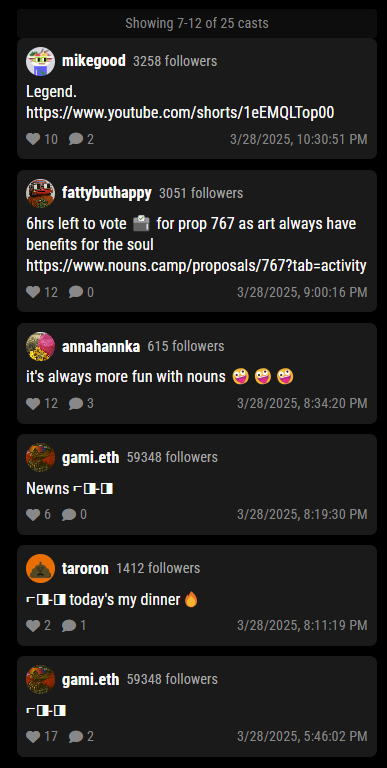

# MMM-NounsTimeline

A MagicMirror module that displays a timeline of casts from Nouns Warpcast Channel, showing author information, cast content, and engagement metrics.



## Features

- Displays a timeline of Nouns casts with author information
- Shows author profile pictures, usernames, and follower counts
- Displays cast text content
- Shows engagement metrics (likes and replies)
- Timestamps for each cast
- Automatic cycling through casts
- Responsive design
- Loading state indicator

## Installation

1. Navigate to your MagicMirror's `modules` directory:
```bash
cd ~/MagicMirror/modules
```

2. Clone this repository:
```bash
git clone https://github.com/XppaiCyberr/MMM-NounsTimeline.git
```

3. Install the module's dependencies:
```bash
cd MMM-NounsTimeline
npm install
```

4. Add the module to your `config/config.js` file:
```javascript
{
    module: "MMM-NounsTimeline",
    position: "top_left",
    config: {
        updateInterval: 5 * 60 * 1000, // 5 minutes
        animationSpeed: 1000,
        maxCasts: 20,
        displayCount: 5,
        pinataJWT: "your-pinata-jwt-token", // Required for Pinata API access
        cycleInterval: 10 * 1000 // 10 seconds per cycle
    }
}
```

## Configuration Options

| Option | Description | Default |
|--------|-------------|---------|
| `updateInterval` | How often to fetch new casts (in milliseconds) | 5 minutes |
| `animationSpeed` | Speed of the fade animation (in milliseconds) | 1000ms |
| `maxCasts` | Maximum number of casts to fetch | 20 |
| `displayCount` | Number of casts to display at once | 5 |
| `pinataJWT` | JWT token for Pinata API access | Required |
| `cycleInterval` | How long to display each set of casts (in milliseconds) | 10 seconds |

## Dependencies

- MagicMirror
- Font Awesome (for icons)
- Pinata API access
- Axios

## Pinata API Setup

This module requires a Pinata JWT token to function. To get your token:

1. Sign up for a Pinata account at https://app.pinata.cloud/
2. Navigate to your API keys section
3. Create a new API key with the necessary permissions
4. Copy the JWT token and add it to your module configuration

## License

MIT License

## Contributing

Contributions are welcome! Please feel free to submit a Pull Request. 